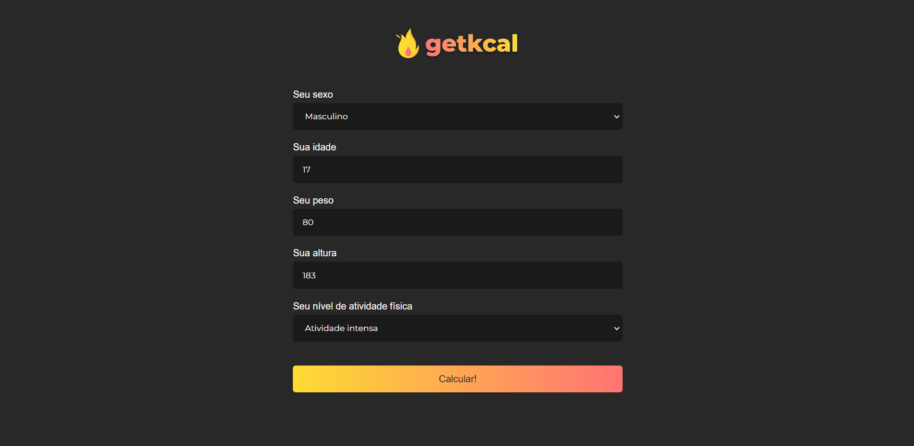

# Get-kcal 

<h1>
  
</h1>

## 🚀 About

Getkcal is a Calories Calculator. This project was developedd to improve my JS study :) and based on [THIS](https://www.youtube.com/watch?v=yiDq9wUiUjc&list=PLK_m105VcD-s-UrI_QnOPnmtFTm3g6126&index=7&t=444s) video.

### 📋 Precondition

This project needs NodeJS because you will need to install the `serve` package to run it in the browser through a node server.

If you do not have NodeJS installed, just follow [THIs](https://nodejs.org) link and install the LTS version.

### 👨‍💻 How to Setup

```bash
  # Clone the project
  $ git clone https://github.com/Levis44/Get-kcal.git
```

To execute the prroject, just run this code this commands:
```sh
  $ cd Get-kcal # acces the folder 
  $ npm init -y # inicialize the package.json
  $ npm install serve -D # installing serve dependency
  $ npx serve . # running the node server
```

## 🛠️ Tools

* [NodeJS](https://nodejs.org) 
* [HTML](https://html5.org/) 
* [CSS](https://developer.mozilla.org/pt-BR/docs/Web/CSS) 
* [JS](https://js.org/) 

## 📝 License

This project is under the MIT license. See the file [LICENSE.md](LICENSE) for more details.

---

<p align="center">Done by Levi Bernardelli Ciarrocchi ✌🏼</p>